# Trajectory Tracking Using a Cascaded PID Controller

## Goal of the Project
The goal is making a cascaded PID controller for the crazyflie cf2x drone, and making it track a trajectory within a specified tight space.


## Getting Familiar with Pybullet environment
This section provides a practical guide for working with PyBullet in the context of UAV simulations using the `gym-pybullet-drones` framework. The following subsections cover essential tasks such as loading models, manipulating joints, applying control forces, and navigating the simulation environment.

---

### 1. Importing URDF Models

Use the `loadURDF()` function to import drone models or environment elements:
```python
p.setAdditionalSearchPath(pybullet_data.getDataPath())
p.loadURDF("plane.urdf", [0, 0, 0], [0, 0, 0, 1])
targid = p.loadURDF("path/to/urdf_file.urdf", [x, y, z], [qx, qy, qz, qw], useFixedBase=False)
```
- The `useFixedBase` flag is `True` for static objects.
- Orientation is specified in quaternion form.

---

### 2. Loading the Ground Plane

Always add a plane to prevent objects from falling:
```python
p.loadURDF("plane.urdf", [0, 0, 0], [0, 0, 0, 1])
```
You can also load custom ground models with textures or friction if needed.

---

### 3. Moving the Camera in Simulation

Use this function to set the camera focus:
```python
focus_position, _ = p.getBasePositionAndOrientation(targid)
p.resetDebugVisualizerCamera(cameraDistance=3, cameraYaw=0, cameraPitch=-10, cameraTargetPosition=focus_position)
```
This helps center the view on the drone or any object of interest.

---

### 4. Getting Joint Types and Limits in PyBullet

List and inspect all joints:
```python
num_joints = p.getNumJoints(targid)
for i in range(num_joints):
    print(p.getJointInfo(targid, i))
```
Key indices:
- `joint_type`: index 2
- `lower_limit`: index 8
- `upper_limit`: index 9
- `max_force`: index 10
- `max_velocity`: index 11

Example:
```python
jointid = 0
lower = p.getJointInfo(targid, jointid)[8]
upper = p.getJointInfo(targid, jointid)[9]
```

---

### 5. Setting the Gravity

Use the following command to set global gravity:
```python
p.setGravity(0, 0, -9.8)
```
Make sure to set gravity before starting simulation steps.

---

### 6. Applying Velocity, Force, and Torque

PyBullet provides multiple control modes for joints and links:

#### Apply velocity to joints:
```python
p.setJointMotorControlArray(
    bodyUniqueId=targid,
    jointIndices=[0, 1, 2, 3],
    controlMode=p.VELOCITY_CONTROL,
    targetVelocities=[10.0, 10.0, 10.0, 10.0]
)
```
- `bodyUniqueId`: ID of the loaded robot or body.
- `jointIndices`: list of joints to control.
- `controlMode`: mode such as `p.VELOCITY_CONTROL` or `p.POSITION_CONTROL`.
- `targetVelocities`: velocities in rad/s for each joint (used in velocity control).
- `targetPositions`: (for position control) desired joint angles in radians.
- `forces`: optional list of max forces to apply.

#### Apply position to joints:
```python
p.setJointMotorControlArray(
    bodyUniqueId=targid,
    jointIndices=[0, 1, 2, 3],
    controlMode=p.POSITION_CONTROL,
    targetPositions=[0.0, 0.0, 0.0, 0.0],
    forces=[2.0, 2.0, 2.0, 2.0]  # optional
)
```
- Use `POSITION_CONTROL` when you want joints to track specific angles.
- Without setting forces, default values in the URDF are used (can be zero).

> ⚠️ Note: In some URDFs (e.g., `cf2x.urdf`), propeller joints may be `FIXED` and won't respond to motor control unless modified.

#### Apply force:
```python
p.applyExternalForce(
    objectUniqueId=targid,
    linkIndex=-1,
    forceObj=[0, 0, 10],
    posObj=[0, 0, 0],
    flags=p.WORLD_FRAME
)
```
- `linkIndex = -1` targets the base link.
- `forceObj`: [x, y, z] force vector in Newtons.
- `posObj`: position of force application relative to the object.
- `flags`: choose `p.WORLD_FRAME` or `p.LINK_FRAME`.

#### Apply torque:
```python
p.applyExternalTorque(
    objectUniqueId=targid,
    linkIndex=-1,
    torqueObj=[1.0, 0.0, 0.0],
    flags=p.LINK_FRAME
)
```
- `torqueObj`: [roll, pitch, yaw] torques.
- Useful for simulating attitude control (e.g., for drones).

---

### 7. World Frame vs. Link Frame Force Application

Specify the reference frame when applying forces:
- **WORLD_FRAME**: aligned with the global coordinate system
- **LINK_FRAME**: aligned with the body or link’s local coordinate system

Example:
```python
p.applyExternalForce(targid, -1, [x_force, y_force, z_force], [0, 0, 0], p.LINK_FRAME)
```
In `gym-pybullet-drones`, forces and torques are applied in `LINK_FRAME` to account for drone orientation:
```python
pyb.applyExternalForce(..., flags=pyb.LINK_FRAME)
pyb.applyExternalTorque(..., flags=pyb.LINK_FRAME)
```

---

## Understanding `cf2x.urdf`

This section provides a detailed breakdown of the `cf2x.urdf` quadrotor model used in the `gym-pybullet-drones` environment. We explore its structure, physical parameters, and how it behaves in the PyBullet simulator.

---

### 1. Physical Structure and Dimensions

The `cf2x.urdf` defines a Crazyflie 2.x style quadrotor, with key physical parameters embedded in the `<properties>` tag:

```xml
<properties 
  arm="0.0397"
  kf="3.16e-10" 
  km="7.94e-12" 
  thrust2weight="2.25" 
  max_speed_kmh="30" 
  gnd_eff_coeff="11.36859" 
  prop_radius="2.31348e-2" 
  drag_coeff_xy="9.1785e-7" 
  drag_coeff_z="10.311e-7" 
  dw_coeff_1="2267.18" 
  dw_coeff_2=".16" 
  dw_coeff_3="-.11" 
/>
```

- **Mass** of `base_link`: 0.027 kg
- **Moment of Inertia**: Approximated as diagonal for simplicity
- **Collision Geometry**: A simple cylinder centered at the base
- **Mesh Visualization**: Referenced `.dae` model

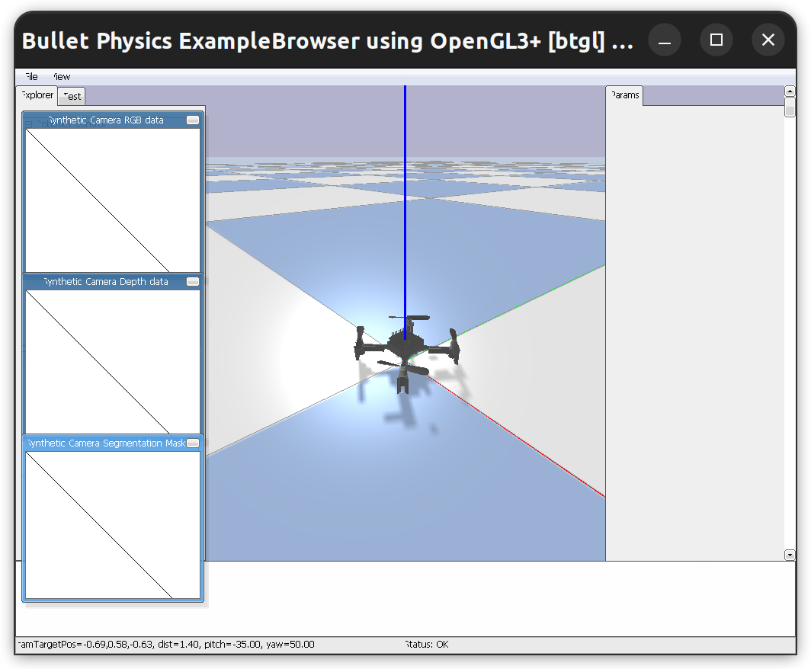


---

### 2. One Rigid Body or Articulated?

All `prop*_link` and `center_of_mass_link` are attached to `base_link` via `fixed` joints:
```xml
<joint name="prop0_joint" type="fixed">
  <parent link="base_link"/>
  <child link="prop0_link"/>
</joint>
```
This means the entire drone is treated as a **single rigid body** — the propellers do not spin or move independently in the physics simulation. Their visual representation is static.

> ✅ **Implication**: Motor behavior must be simulated by applying forces/torques to the `base_link`, not through joint control.

---

### 3. Joint Types and Limits

Use PyBullet to inspect joint info:
```python
for i in range(p.getNumJoints(targid)):
    print(p.getJointInfo(targid, i))
```
You will find that all joints are:
- **Type**: `p.JOINT_FIXED` (type = 4)
- **Force/Velocity limits**: All set to 0

Sample Output:
```
(0, b'prop0_joint', 4, ... force=0.0, velocity=0.0)
```
> ⚠️ Attempting to use `p.setJointMotorControlArray()` will have no effect due to the fixed joint type.

---

### 4. Applying Forces and Torques

Since the propellers don’t spin physically, **thrust and torque must be applied programmatically**:

#### Thrust (Z-direction):
```python
p.applyExternalForce(
    bodyUniqueId=targid,
    linkIndex=-1,
    forceObj=[0, 0, thrust],
    posObj=[0, 0, 0],
    flags=p.LINK_FRAME
)
```

#### Roll, Pitch, Yaw Torques:
```python
p.applyExternalTorque(
    bodyUniqueId=targid,
    linkIndex=-1,
    torqueObj=[roll_torque, pitch_torque, yaw_torque],
    flags=p.LINK_FRAME
)
```
- Use `p.LINK_FRAME` to apply torques relative to drone’s orientation.

---

### 5. Summary
| Feature                  | Value / Configuration                       |
|-------------------------|---------------------------------------------|
| Mass                    | 0.027 kg                                    |
| Propeller Joints        | All fixed                                   |
| Simulation Model        | One rigid body                              |
| Control Method          | External force and torque on `base_link`    |
| Visual Mesh             | `cf2.dae`                                   |
| Collision Geometry      | Cylinder (radius 0.06m, length 0.025m)       |
| Inertial Frame Origin   | `(0, 0, 0)`                                  |

This URDF is minimal but functional, serving as a basis for controller design and reinforcement learning in PyBullet. For advanced motor simulation, a URDF with `continuous` joints and appropriate motor plugins would be needed.

---


## Simulation Setup Environment

This project features a custom-designed simulation environment in PyBullet, created to mimic **agile drone navigation through constrained spaces**. The setup includes:

- **Two vertical red pillars** acting as a narrow passage (tight gap).
- A **yellow circle** marking the **starting point** of the drone.
- A **green circle** indicating the **landing zone**.
- The drone (cf2x.urdf) must pass through the gap and navigate to the landing mark.

This setup is directly inspired by the scenario described in the paper:

> **"Autonomous Navigation of UAVs in Resource Limited Environment Using Deep Reinforcement Learning"**  
> [Paper Link](https://ieeexplore.ieee.org/document/10023581)

The goal is to evaluate control strategies (e.g., PID, force-based, or learning-based) for flying through constrained passages in a **simplified but meaningful layout**.

### Visual Overview

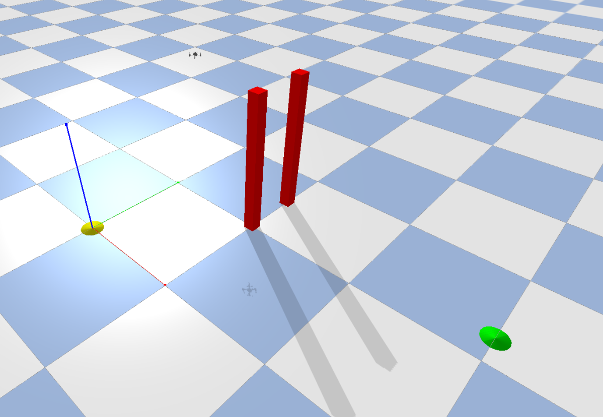

This simple, minimalistic setup serves as a foundation for evaluating various control pipelines such as:
- PID-based waypoint navigation
- Hybrid control strategies (force + PID)
- Future reinforcement learning agents

> 📌 **Note**: All assets (pillars, markers, drone) are URDF-based and fully integrated within PyBullet physics.

---
## Waypoint Following Control

To evaluate the drone’s capability to navigate constrained environments, we implemented a **PID-based waypoint following controller**. This method provides a modular and interpretable way to control the drone's movement through predefined 3D points.

### Trial 1 (`test_pybullet_cf2x.py`)
#### Overview of the Logic
The control strategy is based on splitting the drone’s motion into three main sub-controllers:

1. **Altitude Control (Z-axis):**
   - A PID controller adjusts thrust to maintain or change altitude.
   - Gains (`Kp_thrust`, `Kd_thrust`, `Ki_thrust`) are tuned for smooth vertical transitions.

2. **Planar Position Control (X-Y):**
   - A PD controller computes forces in the X and Y directions.
   - Forces are applied in the **world frame** to direct the drone to each waypoint.

3. **Attitude Control (Roll, Pitch, Yaw):**
   - Roll and pitch are stabilized to remain level.
   - Yaw is regulated to maintain alignment using a proportional-derivative controller.

#### Waypoint Logic
A list of 3D waypoints is defined in sequence:
```python
waypoints = [
    [1.5, 1.25, 1.3],
    [3.0, 1.25, 1.3],
    [3.0, 1.25, 0.1]
]
```
The controller continuously computes the distance between the drone and the current target waypoint. When the drone gets within a certain threshold (`dist < 0.2`), it automatically switches to the next waypoint.

#### PID Tuning Parameters
```python
Kp_thrust = 0.3
Kd_thrust = 1.2
Ki_thrust = 0.00002
Kp_attitude = 2.0
Kd_attitude = 1.0
Kp_xy = 0.3
Kd_xy = 0.1
Kp_yaw = 1.0
```

#### Key Results
- The drone successfully passes through the gap between the pillars but after an initial jump high.
- High overshooting occurs at the landing stage.
- The PID gains are tuned to minimize oscillations and ensure smooth transitions.
- The drone is oscillating too much in the thrust and does not land in terms of z-hight (This is later solved by knowing that I need to put a negative thrust in the minimum thrust level to let the drone land, as when the thrust is zero, the drone just stay still above the waypoint)

#### Visual Results

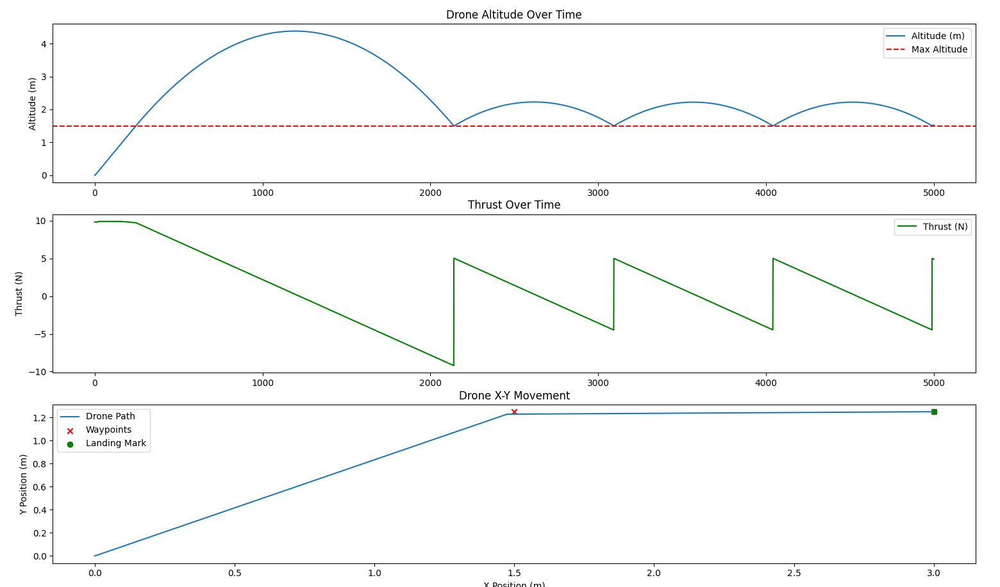


### Trial 2 - Adding More Waypoints (`test_pybullet_cf2x_april_23.py`)

In this trial, the waypoint-following PID controller was extended with **additional waypoints** to represent a more realistic flight mission: from takeoff, through a tight space, and down to a final landing.

#### Enhancements Over Trial 1
- The waypoint list was expanded to 9 key points.
- The altitude controller received **re-tuned PID gains** to ensure smoother ascent and descent.
- Integral accumulation was added and clipped to improve long-term altitude tracking.
- Thrust changes were regulated with a more aggressive `thrust_change_limit` (0.8).

#### Updated Waypoints
```python
waypoints = [
    [0.0, 0.0, 0.5],
    [0.5, 0.5, 1.0],
    [1.0, 1.25, 1.5],
    [1.5, 1.25, 1.5],
    [2.0, 1.25, 1.5],
    [2.5, 1.25, 1.3],
    [3.0, 1.25, 1.0],
    [3.0, 1.25, 0.5],
    [3.0, 1.25, 0.1],
]
```

#### Tuned PID Parameters
```python
Kp_thrust = 0.4
Kd_thrust = 2.0
Ki_thrust = 0.002
Kp_attitude = 2.0
Kd_attitude = 1.0
Kp_xy = 0.3
Kd_xy = 0.1
Kp_yaw = 1.0
```
- Increased `Kd_thrust` helped dampen descent overshoot.
- `Ki_thrust` allowed minor integral correction over time.

#### Observed Behavior
- The drone takes off vertically and follows a complex 3D path through a gap between pillars.
- As the drone reaches each waypoint (within a `0.1` m tolerance), it transitions to the next.
- Final landing at `[3.0, 1.25, 0.1]` is smoother compared to Trial 1.
- But still the spike in the altitude happens
- Thrust Levels were lower and more constant but with small oscillations.
- I still did not know the negative thrust part.

#### Force and Torque Application
Forces and torques were applied in the drone’s **link frame**, keeping the controller orientation-consistent:
```python
p.applyExternalForce(targid, -1, [x_force, y_force, thrust], [0, 0, 0], p.LINK_FRAME)
p.applyExternalTorque(targid, -1, [roll_torque, pitch_torque, yaw_torque], p.LINK_FRAME)
```
#### Visual Results

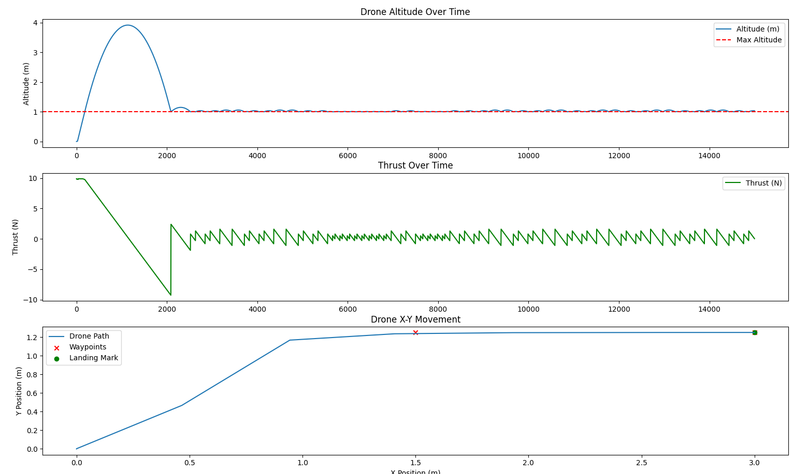

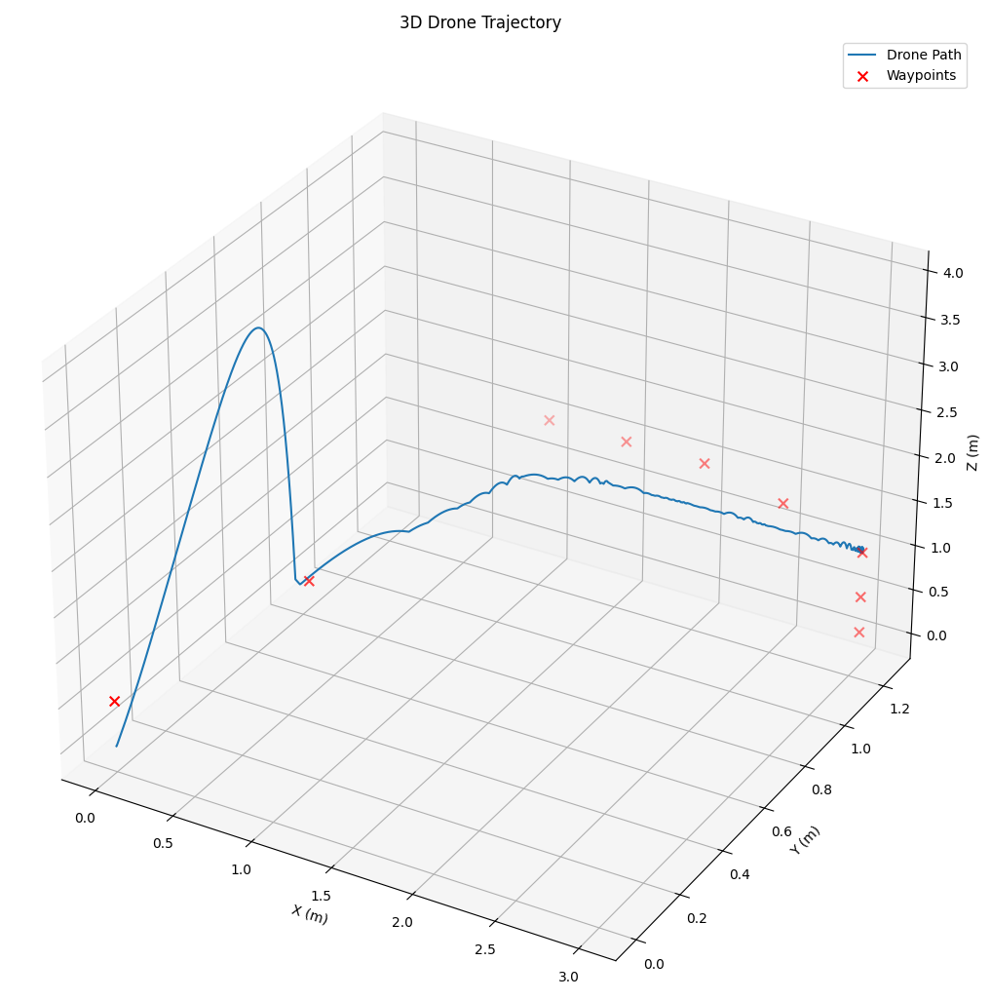

I Tried Even Adding More waypoints, but it did not perform better.

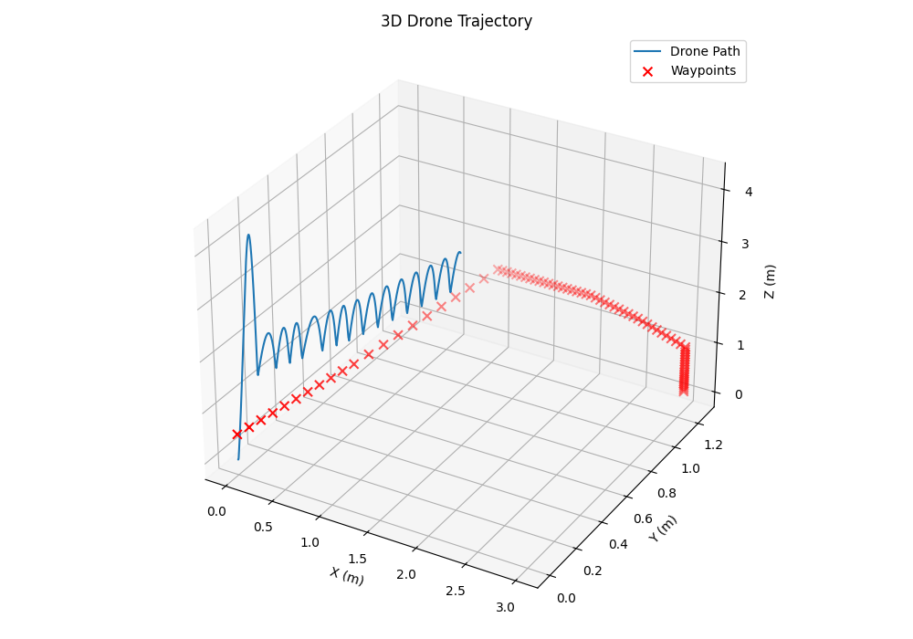


#### Summary
| Aspect              | Value or Change                       |
|---------------------|----------------------------------------|
| Waypoints           | 9 (extended trajectory)               |
| Max Altitude        | 1.0 m                                 |
| Thrust Range        | [0.01, 9.9]                           |
| Thrust Smoothing    | `thrust_change_limit = 0.8`           |
| Performance         | Smooth flight, minimal overshoot      |

---

## Trajectory Generation
I noticed that moving the drones in only waypoints makes non smooth motion, so I tried to generate a smooth trajectory using different methods on the waypoints I determined before, these files are in the `trajectory generation` folder.
Also I was wrong that I didn't start the trajectory from (0,0,0) waypoint, which I will need to solve later in the code.

**Bezier Curve Trajectory**
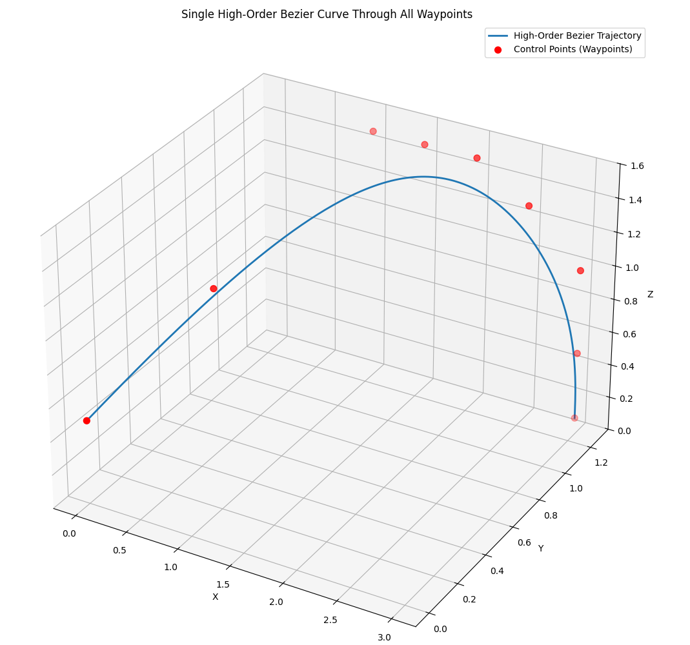

**Minimum Snap (Bezier) Trajectory (Smoothed)**
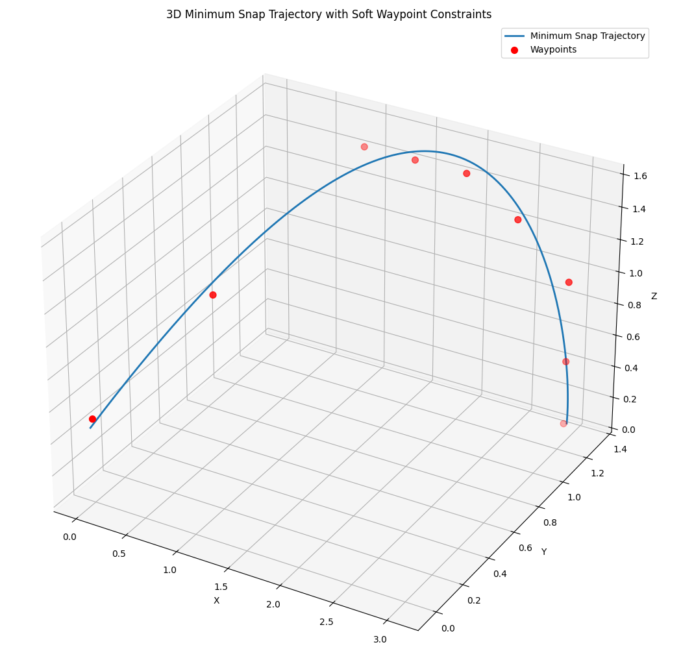

**Quintic Spline Approximation Trajectory**
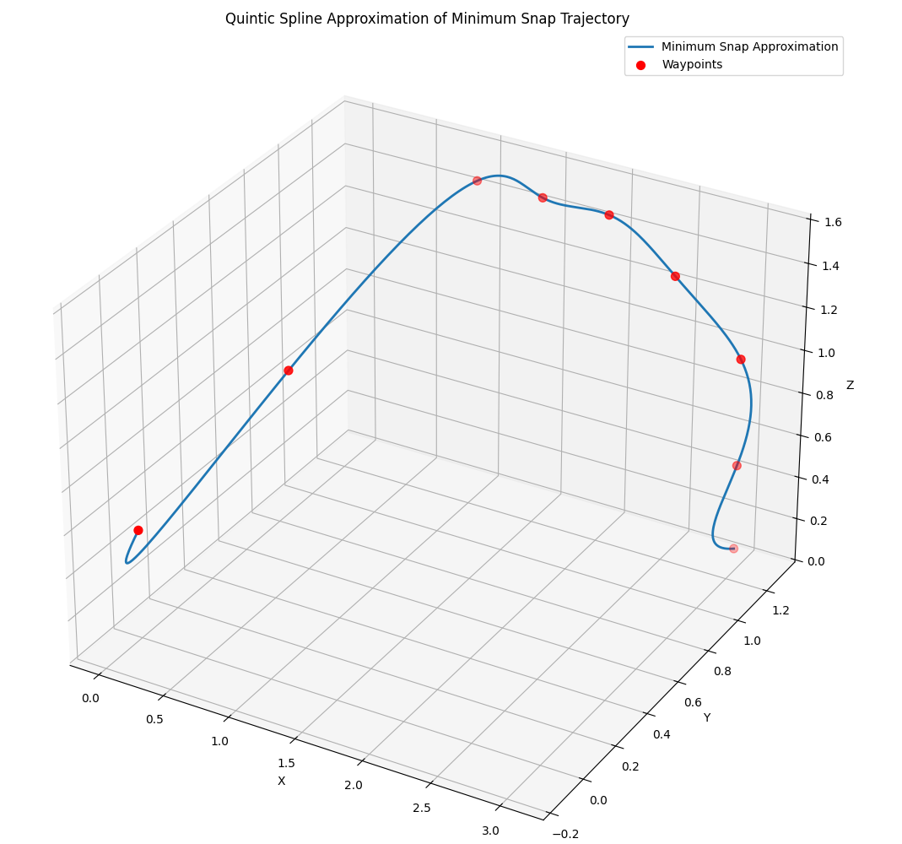

**Motion Primitive Trajectory**
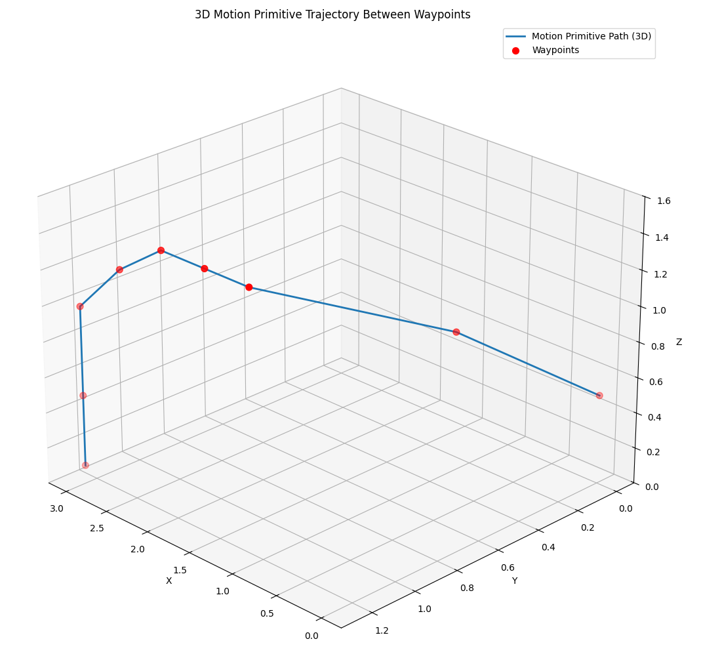

**Chosen Bezier Curve Position Trajectory**
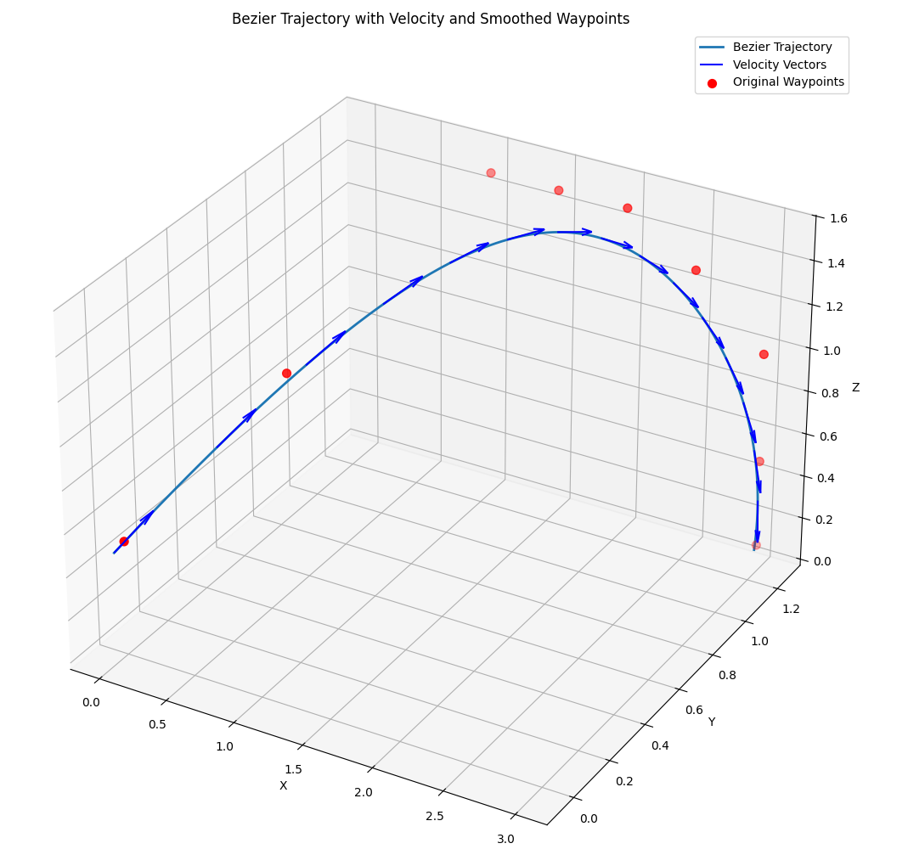

**Chosen Bezier Curve Velocity Trajectory**
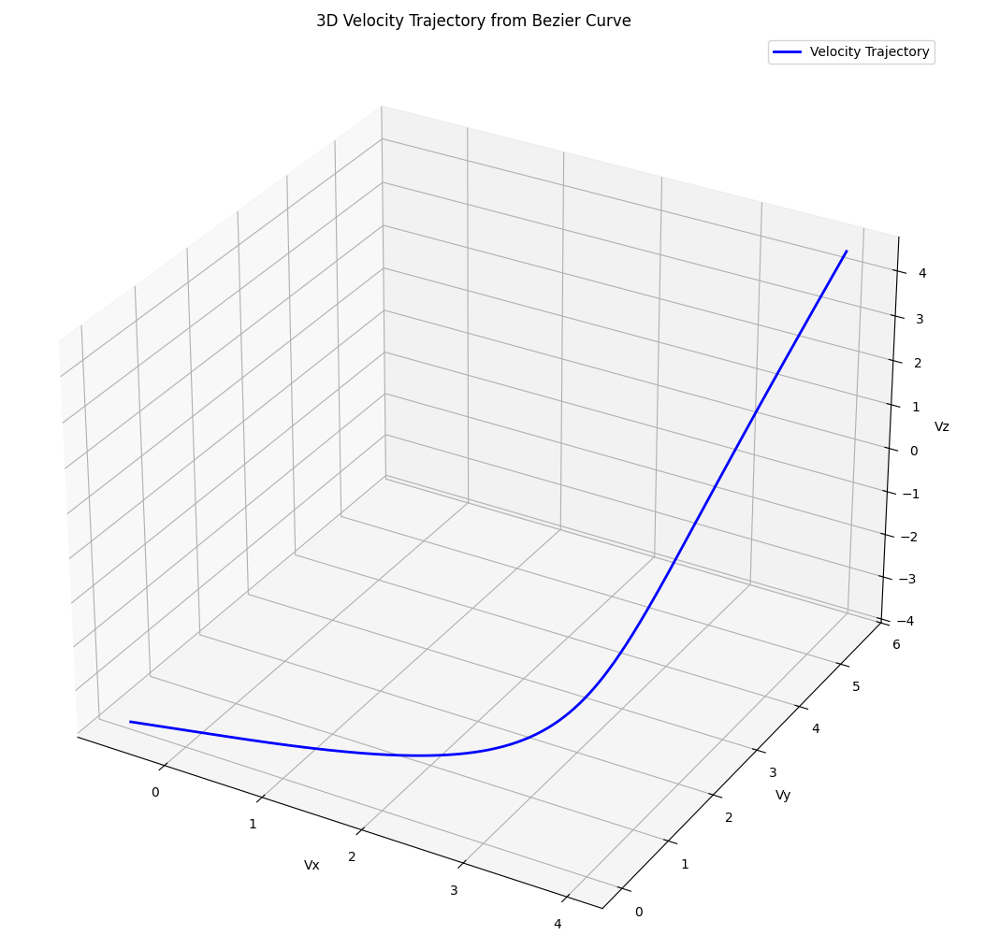

---
## Position Trajectory Control (`test_pybullet_cf2x_may_traj_smooth.py`)

In this trial, instead of using a fixed list of discrete waypoints, a **smooth position trajectory** was generated using Bezier curves and followed by the drone in real time. This trajectory was loaded from a precomputed `.csv` file and treated as a dynamic reference signal for the PID controller.

### Why a Trajectory?
- **Waypoints** create sudden transitions that can cause oscillations or overshoot.
- A **trajectory** provides smooth, continuous positional targets, enabling more fluid and agile motion.
- This approach better simulates real-world drone applications where smooth paths are critical (e.g., inspection, filming, indoor navigation).

### Loading the Trajectory
```python
df = pd.read_csv("bezier_position.csv", header=0)
df = df.astype(float)
waypoints = df.values.tolist()
```
Each row in the CSV corresponds to a desired position `[x, y, z]` at each control timestep.

### PID Control (Updated Gains)
```python
Kp_thrust = 0.4
Kd_thrust = 2.0
Ki_thrust = 15.2
Kp_attitude = 2.0
Kd_attitude = 1.0
Kp_xy = 0.3
Kd_xy = 0.1
Kp_yaw = 1.0
```
- A **significantly higher `Ki_thrust`** gain was used to handle steady-state errors over long trajectories.
- `Kd_thrust` was retained to dampen fast altitude changes.

### Controller Logic Highlights
- For each simulation step, the drone targets the next point in the loaded trajectory.
- X, Y forces are computed from PD control.
- Z thrust is managed via PID.
- Roll, pitch, and yaw are stabilized with proportional-derivative control.

```python
# Apply position and orientation corrections
p.applyExternalForce(targid, -1, [x_force, y_force, thrust], [0, 0, 0], p.LINK_FRAME)
p.applyExternalTorque(targid, -1, [roll_torque, pitch_torque, yaw_torque], p.LINK_FRAME)
```

### Results and Observations
- The drone followed the Bezier-generated path but not with a smooth trajectory at all.
- The oscillation was really high and continous.
- It does not complete the trajectory at all

### 3D Visualization of Trajectory
A 3D plot of the drone’s flight path vs. the intended trajectory is shown below:
```python
ax.plot(x_log, y_log, altitude_log, label='Drone Path')
ax.scatter(way_x, way_y, way_z, color='red', label='Waypoints', marker='x', s=50)
```

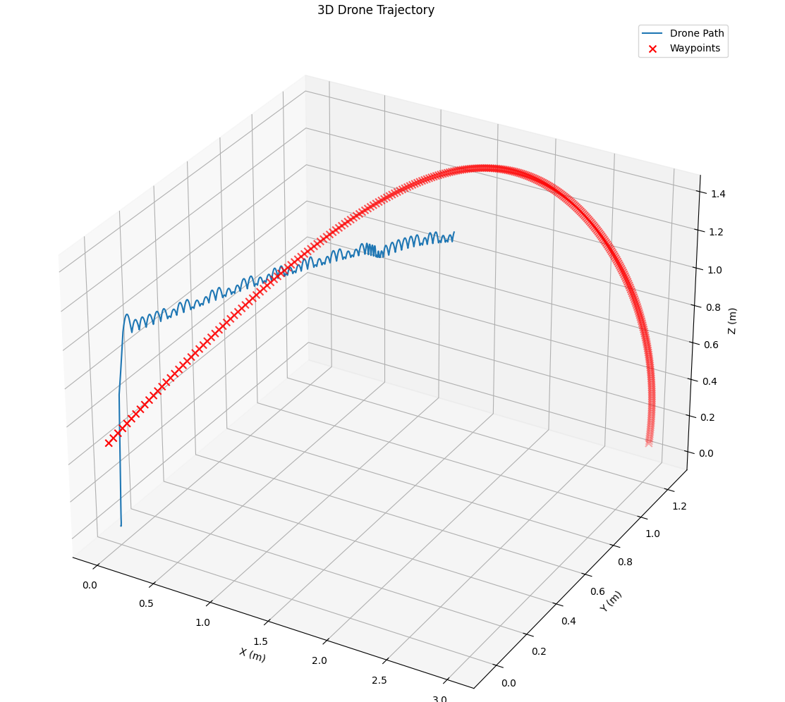

| Metric               | Value                                     |
|----------------------|--------------------------------------------|
| Control Mode         | PID (Trajectory Tracking)                  |
| Reference Source     | `bezier_position.csv`                      |
| Integral Altitude    | Enabled (clipped [-0.5, 0.5])              |
| Max Altitude         | 1.0 m                                     |

---
## Velocity Hybrid Control: Position + Velocity Trajectory Tracking (`test_pybullet_cf2x_may_traj_smooth.py`)

In this advanced trial, the control architecture was extended to incorporate both **position** and **velocity references**. The drone now tracks a Bezier-based trajectory that includes spatial targets and desired velocity vectors at each timestep.

This hybrid control approach improved both **agility** and **smoothness**, especially during acceleration, deceleration, and final descent phases.

---

### What Changed from Previous Trials?
- **Reference Trajectories:**
  - `bezier_position.csv` for 3D positional targets
  - `bezier_velocity.csv` for velocity vectors (`vx, vy, vz`)
- **XY Control** now blends **position error** with **velocity error**.
- **Takeoff logic** implemented before tracking begins.
- **Aggressive gains** to respond more sharply to errors.
- **Altitude PID** gains retuned for faster vertical convergence and better integral correction.

---

### Key Control Gains
```python
Kp_xy = 10.0
Kd_xy = 5.0
Kp_thrust = 10.0
Kd_thrust = 2.5
Ki_thrust = 18.0
Kp_attitude = 2.0
Kd_attitude = 1.0
Kp_yaw = 1.0
```
- `Kp_xy` and `Kd_xy` increased significantly for aggressive XY convergence.
- `Ki_thrust` was boosted to stabilize vertical drift in long-term flights.

---

### Hybrid Control Logic
#### Altitude (Z):
```python
target_thrust = 9.8 + Kp_thrust * error_z + Kd_thrust * d_error_z + Ki_thrust * integral_error_z
```

#### XY (Hybrid):
```python
error_pos = ref_pos[:2] - pos[:2]
error_vel = ref_vel[:2] - [vx, vy]
x_force = Kp_xy * error_pos[0] + Kd_xy * error_vel[0]
y_force = Kp_xy * error_pos[1] + Kd_xy * error_vel[1]
```
This ensures the drone not only reaches the correct spatial location but also matches the intended velocity at each point along the path.

---

### Takeoff Phase Logic
Before trajectory tracking begins, the drone is commanded to take off to the initial altitude using a fixed thrust value:
```python
while pos[2] < takeoff_z - 0.05:
    thrust = 11.0
    p.applyExternalForce(...)
```
Only after reaching the target altitude does the main loop start.

---

### Results 
- Best performance till now
- THe trajectory tracking is not perfect, but I knew that I am on the right track when the drone landed a bit, in which it is adding negative thrust.
- So In the final Stage I tried tunning the negative thrust isntead of doing a forced landing approach in which I tried and it worked.

---

### Trajectory Comparison (3D)
To visualize tracking performance:
```python
ax.plot(x_log, y_log, z_log, label="Actual Trajectory")
ax.plot(ref_x, ref_y, ref_z, '--', label="Reference Trajectory")
```

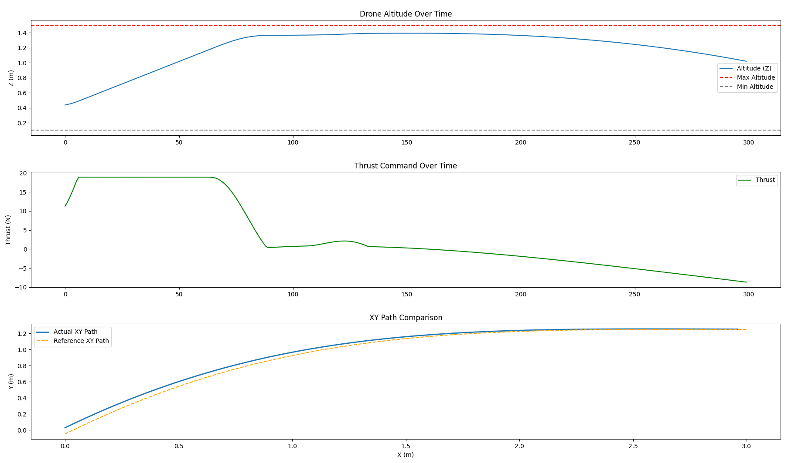

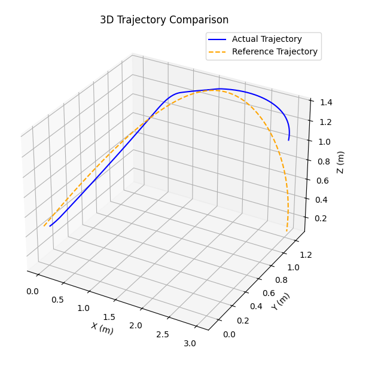

**Forced Landing Approach**
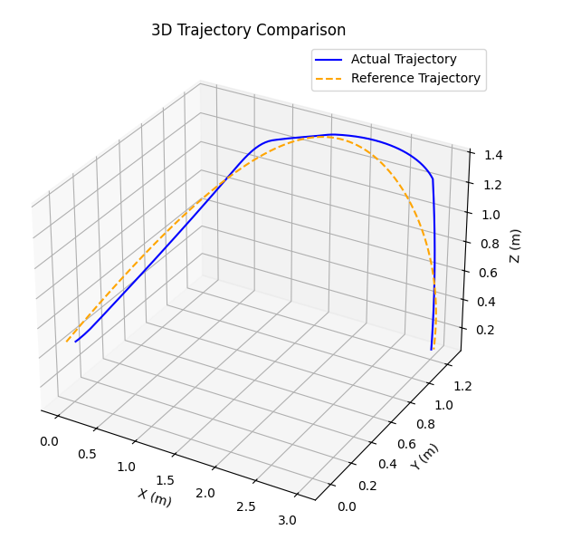


---


### Performance Summary
| Feature                | Description                                      |
|------------------------|--------------------------------------------------|
| Reference Data         | Position + Velocity CSV                          |
| Control Type           | Hybrid PD (XY) + PID (Z) + PD (Attitude/Yaw)     |
| Z Control              | Enhanced with integral and higher thrust limits |
| XY Control             | Position + Velocity Error                        |
| Max Thrust             | Increased to 18.9 for sharper climbs             |
| Result                 | ✅ Best trajectory tracking performance so far   |

---

## Hybrid Control Optimization: Effect of Thrust Constraints (`test_pybullet_cf2x_may_5_traj_land.py`)

This final control refinement focuses on **optimizing thrust parameters** to enhance trajectory tracking performance during high-speed or complex maneuvers. Specifically, the following parameters were adjusted:

- **`max_thrust`**: increased to allow aggressive altitude correction.
- **`min_thrust`**: reduced to allow faster descents or active braking.
- **`thrust_change_limit`**: widened to avoid sluggish response.
- **Z-axis PID gains**: aggressively tuned to respond quickly to altitude errors.

---

### Motivation for Tuning Thrust Bounds
The default thrust range in earlier trials (e.g., `min_thrust = 0.01`, `max_thrust = 18.9`) limited the drone's ability to:
- **Climb rapidly** during sharp altitude changes.
- **Descend efficiently** without stalling.
- **Correct aggressively** for disturbances.

By raising `max_thrust` to `28.9` and allowing negative `min_thrust` (down to `-20.1`), the drone could react more like a real-world agile quadrotor under force-based control.

---

### Tuned Parameters
```python
max_thrust = 28.9
min_thrust = -20.1
thrust_change_limit = 20.0
```

### Updated Altitude PID Gains
```python
Kp_thrust = 105.0
Kd_thrust = 1155.5
Ki_thrust = 610.0
```
- These values were scaled to match the wider thrust range.
- The integral term (`Ki_thrust`) helps eliminate long-term drift.
- The derivative gain (`Kd_thrust`) heavily damps overshoot.

---

### Observed Improvements
- **Takeoff** is completed faster, reaching target Z height in fewer steps.
- **Altitude tracking** is significantly tighter, especially under velocity disturbances.
- **Descent** is controlled, without the drone floating indefinitely near ground level.
- The gains was much higher to reach this results, but actually compared to the original `gym-pybullet-drones`, they used high gains also in their PID control.

> 📌 These improvements were **not achievable** with conservative thrust limits, even if the controller gains were high.

---

### Final Trajectory Comparison
The following 3D and 2D plots validate the optimization:
- **Z tracking** is smoother and within bounds.
- **Thrust levels** vary dynamically without saturation.
- **XY paths** closely follow the reference curve.

**Frist Trial**:
- `Kp_xy = 10.0`
- `Kd_xy = 5.0`
- `Kp_thrust = 35.0`
- `Kd_thrust = 75.5`
- `Ki_thrust = 58.0`
- `Kp_attitude = 2.0`
- `Kd_attitude = 1.0`
- `Kp_yaw = 1.0`

- `thrust = 9.8`
- `max_thrust = 18.9`
- `min_thrust = -20.1`
- `thrust_change_limit` = 20.0

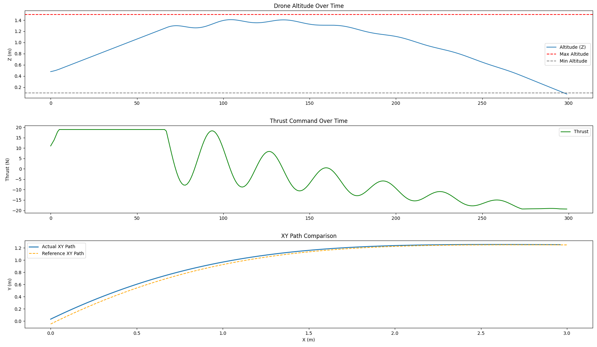


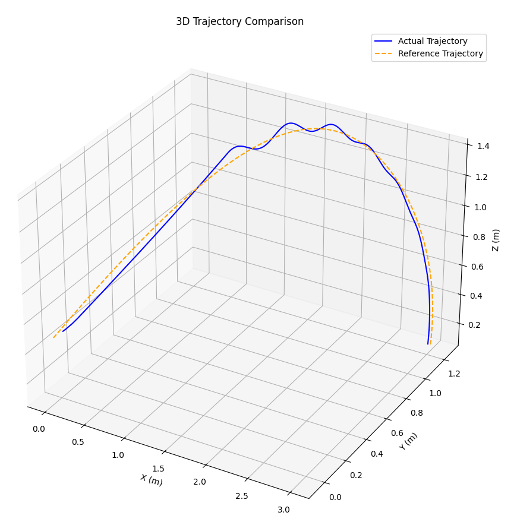


**Best Results**
- `Kp_xy = 28.0`
- `Kd_xy = 5.0`
- `Kp_thrust = 105.0`
- `Kd_thrust = 1155.5`
- `Ki_thrust = 610.0`
- `Kp_attitude = 2.0`
- `Kd_attitude = 1.0`
- `Kp_yaw = 1.0`

- `thrust = 9.8`
- `max_thrust = 28.9`
- `min_thrust = -20.1`
- `thrust_change_limit` = 20.0

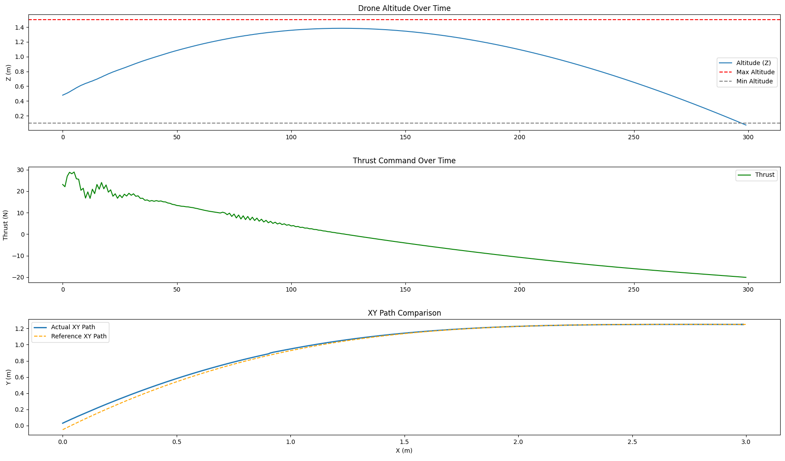


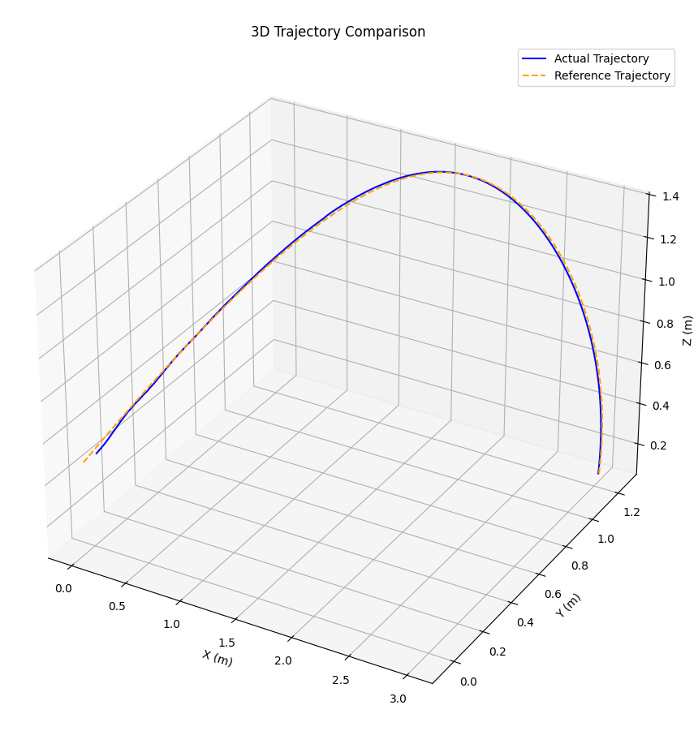


---

### Summary
| Optimization Aspect     | Result                                               |
|--------------------------|------------------------------------------------------|
| Max Thrust               | Increased to 28.9 → Better climb responsiveness     |
| Min Thrust               | Decreased to -20.1 → Enabled aggressive descent     |
| Thrust Change Limit      | Increased to 20.0 → Allowed faster vertical tuning  |
| Altitude PID Gains       | Increased for sharper correction                    |
| Overall Outcome          | ✅ Most agile and stable controller so far          |

This concludes the PID-based hybrid control pipeline development. These insights and parameter tuning strategies can be reused or initialized in **future learning-based controllers** to speed up convergence and safety during training.


---
## Future Improvments
- This controller is tuned specifically for this trajectory, which is making it specific, so maybe testing it with several trajectories could be good.
- The next step is to implement RL to make the drone find the best path between the obstacles and tune the gains.

---

## ORIGINAL REPO
---
# gym-pybullet-drones

This is a minimalist refactoring of the original `gym-pybullet-drones` repository, designed for compatibility with [`gymnasium`](https://github.com/Farama-Foundation/Gymnasium), [`stable-baselines3` 2.0](https://github.com/DLR-RM/stable-baselines3/pull/1327), and SITL [`betaflight`](https://github.com/betaflight/betaflight)/[`crazyflie-firmware`](https://github.com/bitcraze/crazyflie-firmware/).

> **NOTE**: if you prefer to access the original codebase, presented at IROS in 2021, please `git checkout [paper|master]` after cloning the repo, and refer to the corresponding `README.md`'s.

 

## Installation

Tested on Intel x64/Ubuntu 22.04 and Apple Silicon/macOS 14.1.

```sh
git clone https://github.com/utiasDSL/gym-pybullet-drones.git
cd gym-pybullet-drones/

conda create -n drones python=3.10
conda activate drones

pip3 install --upgrade pip
pip3 install -e . # if needed, `sudo apt install build-essential` to install `gcc` and build `pybullet`

```

## Use

### PID control examples

```sh
cd gym_pybullet_drones/examples/
python3 pid.py # position and velocity reference
python3 pid_velocity.py # desired velocity reference
```

### Downwash effect example

```sh
cd gym_pybullet_drones/examples/
python3 downwash.py
```

### Reinforcement learning examples (SB3's PPO)

```sh
cd gym_pybullet_drones/examples/
python learn.py # task: single drone hover at z == 1.0
python learn.py --multiagent true # task: 2-drone hover at z == 1.2 and 0.7
```

 

### utiasDSL `pycffirmware` Python Bindings example (multiplatform, single-drone)

Install [`pycffirmware`](https://github.com/utiasDSL/pycffirmware?tab=readme-ov-file#installation) for Ubuntu, macOS, or Windows

```sh
cd gym_pybullet_drones/examples/
python3 cff-dsl.py
```

### Betaflight SITL example (Ubuntu only)

```sh
git clone https://github.com/betaflight/betaflight 
cd betaflight/
git checkout cafe727 # `master` branch head at the time of writing (future release 4.5)
make arm_sdk_install # if needed, `apt install curl``
make TARGET=SITL # comment out line: https://github.com/betaflight/betaflight/blob/master/src/main/main.c#L52
cp ~/gym-pybullet-drones/gym_pybullet_drones/assets/eeprom.bin ~/betaflight/ # assuming both gym-pybullet-drones/ and betaflight/ were cloned in ~/
betaflight/obj/main/betaflight_SITL.elf
```

In another terminal, run the example

```sh
conda activate drones
cd gym_pybullet_drones/examples/
python3 beta.py --num_drones 1 # check the steps in the file's docstrings to use multiple drones
```

## Citation

If you wish, please cite our [IROS 2021 paper](https://arxiv.org/abs/2103.02142) ([and original codebase](https://github.com/utiasDSL/gym-pybullet-drones/tree/paper)) as

```bibtex
@INPROCEEDINGS{panerati2021learning,
      title={Learning to Fly---a Gym Environment with PyBullet Physics for Reinforcement Learning of Multi-agent Quadcopter Control}, 
      author={Jacopo Panerati and Hehui Zheng and SiQi Zhou and James Xu and Amanda Prorok and Angela P. Schoellig},
      booktitle={2021 IEEE/RSJ International Conference on Intelligent Robots and Systems (IROS)},
      year={2021},
      volume={},
      number={},
      pages={7512-7519},
      doi={10.1109/IROS51168.2021.9635857}
}
```

## References

- Carlos Luis and Jeroome Le Ny (2016) [*Design of a Trajectory Tracking Controller for a Nanoquadcopter*](https://arxiv.org/pdf/1608.05786.pdf)
- Nathan Michael, Daniel Mellinger, Quentin Lindsey, Vijay Kumar (2010) [*The GRASP Multiple Micro UAV Testbed*](http://citeseerx.ist.psu.edu/viewdoc/download?doi=10.1.1.169.1687&rep=rep1&type=pdf)
- Benoit Landry (2014) [*Planning and Control for Quadrotor Flight through Cluttered Environments*](http://groups.csail.mit.edu/robotics-center/public_papers/Landry15)
- Julian Forster (2015) [*System Identification of the Crazyflie 2.0 Nano Quadrocopter*](https://www.research-collection.ethz.ch/handle/20.500.11850/214143)
- Antonin Raffin, Ashley Hill, Maximilian Ernestus, Adam Gleave, Anssi Kanervisto, and Noah Dormann (2019) [*Stable Baselines3*](https://github.com/DLR-RM/stable-baselines3)
- Guanya Shi, Xichen Shi, Michael O’Connell, Rose Yu, Kamyar Azizzadenesheli, Animashree Anandkumar, Yisong Yue, and Soon-Jo Chung (2019)
[*Neural Lander: Stable Drone Landing Control Using Learned Dynamics*](https://arxiv.org/pdf/1811.08027.pdf)
- C. Karen Liu and Dan Negrut (2020) [*The Role of Physics-Based Simulators in Robotics*](https://www.annualreviews.org/doi/pdf/10.1146/annurev-control-072220-093055)
- Yunlong Song, Selim Naji, Elia Kaufmann, Antonio Loquercio, and Davide Scaramuzza (2020) [*Flightmare: A Flexible Quadrotor Simulator*](https://arxiv.org/pdf/2009.00563.pdf)

## Core Team WIP

- [ ] Multi-drone `crazyflie-firmware` SITL support (@spencerteetaert, @JacopoPan)
- [ ] Use SITL services with steppable simulation (@JacopoPan)

## Desired Contributions/PRs

- [ ] Add motor delay, advanced ESC modeling by implementing a buffer in `BaseAviary._dynamics()`
- [ ] Replace `rpy` with quaternions (and `ang_vel` with body rates) by editing `BaseAviary._updateAndStoreKinematicInformation()`, `BaseAviary._getDroneStateVector()`, and the `.computeObs()` methods of relevant subclasses

## Troubleshooting

- On Ubuntu, with an NVIDIA card, if you receive a "Failed to create and OpenGL context" message, launch `nvidia-settings` and under "PRIME Profiles" select "NVIDIA (Performance Mode)", reboot and try again.

Run all tests from the top folder with

```sh
pytest tests/
```

-----
> University of Toronto's [Dynamic Systems Lab](https://github.com/utiasDSL) / [Vector Institute](https://github.com/VectorInstitute) / University of Cambridge's [Prorok Lab](https://github.com/proroklab)
